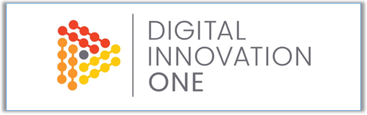

<!-- Badges session -->

  
  <!-- languages -->
  
  <!-- repo size -->
  
  <!-- last commit -->
  
  <!-- licence MIT -->
  

<!--Banner session-->

<!--About session-->
<h1 align="center">Formação Python Developer Digital Innovation One</h1>

# Sistema Bancário com Python
No primeiro projeto, você tivemos a oportunidade de criar um Sistema Bancário em Python. O objetivo foi implementar três operações essenciais: depósito, saque e extrato. O sistema será desenvolvido para um banco que busca monetizar suas operações. Durante o desafio, tivemos a chance de aplicar seus conhecimentos em programação Python e criamos um sistema funcional que simulou as operações bancárias onde foi preparado para aprimorar suas habilidades e demonstrar sua capacidade de desenvolver soluções práticas e eficientes.

Neste desafio, teremos a oportunidade de otimizar o Sistema Bancário previamente desenvolvido com o uso de funções Python. O objetivo é aprimorar a estrutura e a eficiência do sistema, implementando as operações de depósito, saque e extrato em funções específicas. Termos a chance de refatorar o código existente, dividindo-o em funções reutilizáveis, facilitando a manutenção e o entendimento do sistema como um todo. Prepare-se para aplicar conceitos avançados de programação e demonstrar sua habilidade em criar soluções mais elegantes e eficientes utilizando Python.

Já dominamos o universo do desenvolvimento Python e projeto "Criando um Sistema Bancário com Python" oferece uma experiência prática de desenvolvimento de software financeiro. Os participantes construirão um sistema completo, abordando funcionalidades como criação de contas, transações e segurança. É uma oportunidade para aprimorar habilidades de programação Python e compreender conceitos financeiros e de segurança.

### Orientador:
Guilherme Carvalho
Python Consultant, Oak Solutions

##
<!--Bottom session-->
<h4 align=center>Made with by <a href="https://www.linkedin.com/in/gdmacedo/">Macedo, Glener Diniz</a></h4>